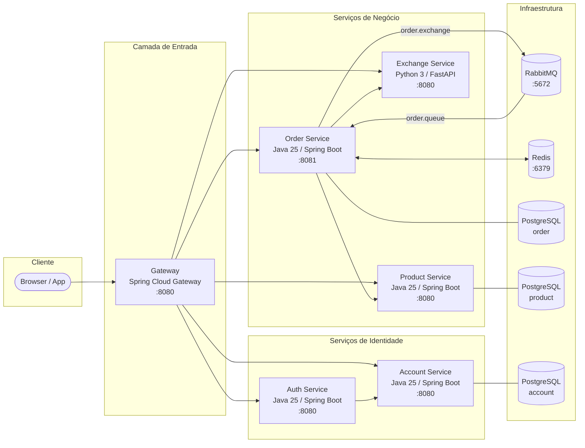
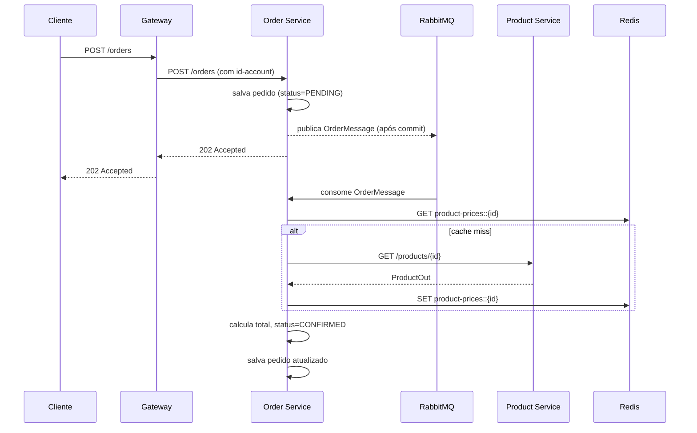
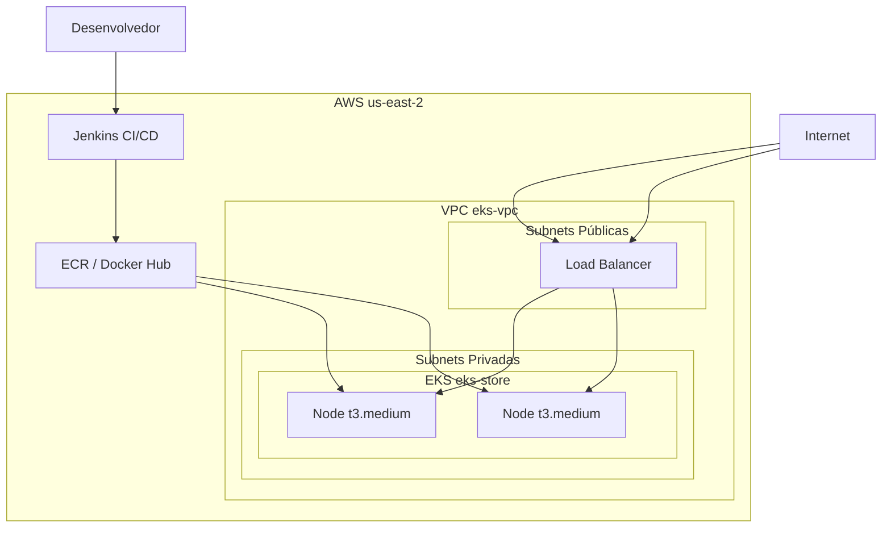

# Arquitetura

## Visão geral

A plataforma é composta por microserviços independentes que se comunicam via HTTP (OpenFeign) e mensageria assíncrona (RabbitMQ). O Gateway é o único ponto de entrada externo — todos os clientes se comunicam exclusivamente por ele.

---

## Stack tecnológica

| Serviço | Linguagem | Framework | Versão |
|---------|-----------|-----------|--------|
| Gateway | Java 25 | Spring Cloud Gateway | 4.0.5 |
| Auth | Java 25 | Spring Boot | 4.0.5 |
| Account | Java 25 | Spring Boot | 4.0.5 |
| Order | Java 25 | Spring Boot | 4.0.5 |
| Product | Java 25 | Spring Boot | 4.0.5 |
| Exchange | Python 3 | FastAPI | — |

**Spring Cloud:** 2025.1.1 (OpenFeign, Gateway)  
**Banco de dados:** PostgreSQL 16/17 (schema isolado por serviço)  
**Migrations:** Flyway  
**Mensageria:** RabbitMQ 3  
**Cache:** Redis 7  

---

## Padrões adotados

### Módulo de contrato

Cada serviço Java é dividido em dois módulos Maven:

- **`<service>`** — módulo de contrato: interface OpenFeign + DTOs (`*In`, `*Out`). Publicado no repositório Maven local para ser consumido por outros serviços.
- **`<service>-service`** — implementação: lógica de negócio, persistência, configuração.

Isso garante que o consumidor de um serviço dependa apenas do contrato, sem acoplamento à implementação.

### Comunicação entre serviços

- **Síncrona:** OpenFeign (HTTP/REST) — usada quando a resposta é necessária imediatamente (ex: Order consulta Product e Exchange).
- **Assíncrona:** RabbitMQ — usada para processamento que pode ocorrer depois do retorno ao cliente (ex: enriquecimento de preços do pedido).

### Autenticação

O Gateway valida o JWT em todas as rotas protegidas antes de encaminhar ao serviço destino. Os serviços internos confiam no Gateway e não revalidam o token.

### Banco de dados

Cada serviço tem seu próprio banco PostgreSQL isolado. O Order e o Product usam schemas nomeados (`orders`, `products`) dentro de databases dedicadas para separação lógica.

---

## Fluxo de criação de pedido

---

## Infraestrutura AWS

