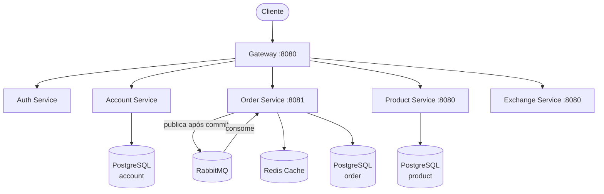

# Store — Plataforma de Microserviços

Projeto desenvolvido na disciplina **Plataformas, Microserviços, DevOps e APIs** — Insper 2026.1.

Instrutor: **Humberto Sandmann**

---

## Sobre o projeto

A Store é uma plataforma de e-commerce baseada em microserviços que permite aos usuários comprar e vender produtos em diferentes moedas. Cada serviço é desenvolvido, versionado e implantado de forma independente, seguindo os princípios de baixo acoplamento e alta coesão.

---

## Grupo

| Membro | Responsabilidade |
|--------|-----------------|
| Rafael Ken | Order API, Gateway, Auth, Account |
| Manoela | Product API |
| Vinícius | Exchange API |

---

## Repositórios

**Repositório principal:** [insper-rafaken/Microservicos-rafael-manoela-vinicius](https://github.com/insper-rafaken/Microservicos-rafael-manoela-vinicius)

| Serviço | Repositório |
|---------|------------|
| order (contrato) | [insper-rafaken/order](https://github.com/insper-rafaken/order) |
| order-service | [insper-rafaken/order-service](https://github.com/insper-rafaken/order-service) |
| product (contrato) | [insper-rafaken/product](https://github.com/insper-rafaken/product) |
| product-service | [insper-rafaken/product-service](https://github.com/insper-rafaken/product-service) |
| exchange | [vin1ciusL/exchange](https://github.com/vin1ciusL/exchange) |
| exchange-interface (contrato) | [vin1ciusL/exchange-interface](https://github.com/vin1ciusL/exchange-interface) |
| account | [insper-rafaken/account](https://github.com/insper-rafaken/account) |
| account-service | [insper-rafaken/account-service](https://github.com/insper-rafaken/account-service) |
| auth | [insper-rafaken/auth](https://github.com/insper-rafaken/auth) |
| auth-service | [insper-rafaken/auth-service](https://github.com/insper-rafaken/auth-service) |
| gateway-service | [insper-rafaken/gateway-service](https://github.com/insper-rafaken/gateway-service) |

---

## Arquitetura geral

---

## Status de entrega

| Tarefa | Peso | Status |
|--------|------|--------|
| Gateway | 5% | ✅ |
| Auth | 5% | ✅ |
| Account | 5% | ✅ |
| Exchange | 5% | ✅ |
| Bottlenecks | 20% | ✅ RabbitMQ + Redis |
| AWS | 5% | ✅ |
| EKS | 10% | ✅ |
| CI/CD (Jenkins) | 10% | ✅ |
| Load Testing | 15% | ✅ |
| PaaS & Custos | 10% | ✅ |
| MkDocs | 10% | ✅ |

---

## Vídeo de Apresentação

  <iframe src="https://www.youtube.com/embed/8GVlpTc6i2U" style="position: absolute; top: 0; left: 0; width: 100%; height: 100%;" frameborder="0" allowfullscreen></iframe>

