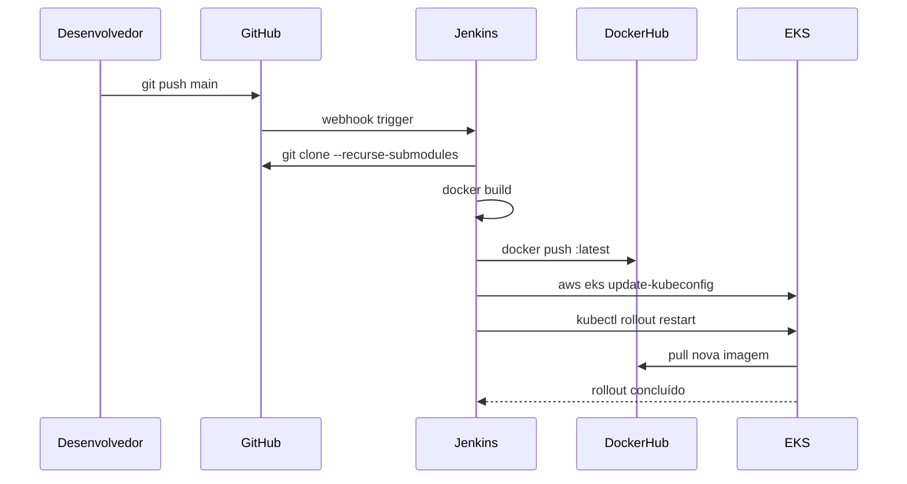

# CI/CD — Jenkins

O pipeline de CI/CD é implementado com Jenkins, executando build, push da imagem Docker e deploy automático no EKS a cada push na branch `main`.

---

## Estrutura dos pipelines

Existem dois níveis de Jenkinsfile:

- **Raiz do repositório principal** (`Jenkinsfile`) — orquestra o build e deploy de `order` e `product` a partir do repo principal com submodules.
- **Cada serviço** (`Jenkinsfile` no repo do serviço) — pipeline individual para build e deploy do serviço específico.

---

## Pipeline principal (raiz)

```groovy
pipeline {
    agent any

    environment {
        DOCKERHUB_USER = 'rafaelken'
        EKS_CLUSTER    = 'eks-store'
        AWS_REGION     = 'us-east-2'
    }

    stages {
        stage('Checkout') {
            steps { checkout scm }
        }

        stage('Build & Push Order') {
            steps {
                withCredentials([usernamePassword(
                    credentialsId: 'dockerhub-credentials', ...)]) {
                    sh '''
                        docker build -t $DOCKERHUB_USER/order:latest \
                            -f api/order/order-service/Dockerfile .
                        docker push $DOCKERHUB_USER/order:latest
                    '''
                }
            }
        }

        stage('Deploy to EKS') {
            steps {
                withCredentials([
                    string(credentialsId: 'aws-access-key-id', ...),
                    string(credentialsId: 'aws-secret-access-key', ...),
                    string(credentialsId: 'aws-session-token', ...)
                ]) {
                    sh '''
                        aws eks update-kubeconfig --region $AWS_REGION --name $EKS_CLUSTER
                        kubectl rollout restart deployment/order
                    '''
                }
            }
        }
    }
}
```

---

## Pipeline por serviço (order-service)

Cada serviço tem seu próprio pipeline com build multi-platform (suporta `linux/amd64` e `linux/arm64`, necessário para Mac com Apple Silicon):

```groovy
stage('Build & Push Image') {
    steps {
        sh '''
            docker buildx create --use --name multiarch --driver docker-container || true
            docker buildx build \
                --platform linux/arm64,linux/amd64 \
                -t $NAME:latest \
                --push \
                .
        '''
    }
}
```

---

## Credenciais no Jenkins

As seguintes credenciais devem ser cadastradas em **Manage Jenkins → Credentials**:

| ID | Tipo | Descrição |
|----|------|-----------|
| `github-credentials` | Username with password | Token de acesso ao GitHub |
| `dockerhub-credentials` | Username with password | Usuário e senha do Docker Hub |
| `aws-access-key-id` | Secret text | AWS Access Key ID |
| `aws-secret-access-key` | Secret text | AWS Secret Access Key |
| `aws-session-token` | Secret text | AWS Session Token (SSO) |

!!! warning "AWS Session Token"
    A conta Insper usa SSO, que gera credenciais temporárias com `AWS_SESSION_TOKEN`. O token expira periodicamente e precisa ser atualizado manualmente nas credenciais do Jenkins.

---

## Configurar pipeline no Jenkins

1. **New Item** → **Pipeline**
2. **Pipeline definition:** Pipeline script from SCM
3. **SCM:** Git
4. **Repository URL:** `https://github.com/insper-rafaken/Microservicos-rafael-manoela-vinicius.git`
5. **Credentials:** `github-credentials`
6. **Branch:** `*/main`
7. **Script Path:** `Jenkinsfile`
8. Salvar → **Build Now**

---

## Fluxo completo


