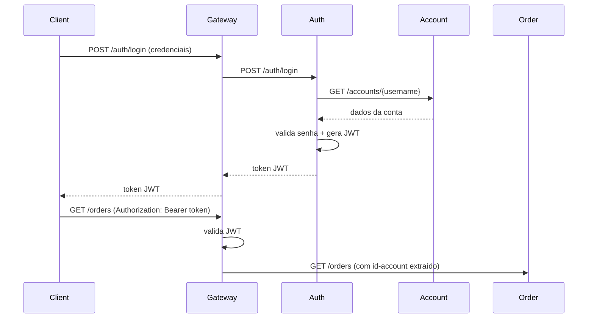

# Auth Service

**Responsável:** Rafael Ken  
**Repositórios:** [insper-rafaken/auth](https://github.com/insper-rafaken/auth) · [insper-rafaken/auth-service](https://github.com/insper-rafaken/auth-service)  
**Stack:** Java 25 · Spring Boot 4.0.5  
**Porta:** `8080`

---

## Responsabilidade

Autenticação e autorização via JWT. Emite tokens para usuários autenticados e valida tokens nas requisições que passam pelo Gateway.

---

## Funcionamento

O Auth Service depende do Account Service para validar credenciais. O fluxo de autenticação é:

---

## Configuração JWT

| Variável | Descrição |
|----------|-----------|
| `JWT_SECRET_KEY` | Chave secreta para assinar tokens |
| `JWT_HTTP_ONLY` | Define se o token é enviado como cookie HttpOnly (padrão: `true`) |

!!! warning "Segurança"
    A variável `JWT_SECRET_KEY` é injetada via secret do Kubernetes (`app-secrets`) e nunca é commitada no repositório.
