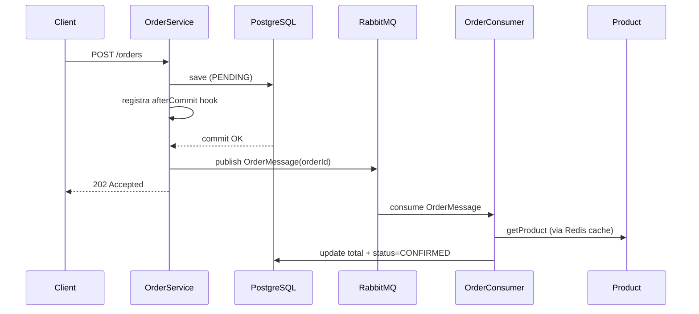

# Order API

**Responsável:** Rafael Ken  
**Repositórios:** [order](https://github.com/insper-rafaken/order) · [order-service](https://github.com/insper-rafaken/order-service)  
**Stack:** Java 25 · Spring Boot 4.0.5 · PostgreSQL 16 · RabbitMQ · Redis  
**Porta:** `8081`

---

## Responsabilidade

Gerencia o ciclo de vida dos pedidos: criação, enriquecimento assíncrono de preços e consulta com conversão de moeda.

---

## Endpoints

| Método | Rota | Descrição | Auth |
|--------|------|-----------|------|
| `POST` | `/orders` | Cria um pedido | `id-account` header |
| `GET` | `/orders` | Lista todos os pedidos | — |
| `GET` | `/orders/{id}` | Busca pedido por ID | `id-account` header |

### POST /orders

Cria o pedido com status `PENDING` e retorna imediatamente `202 Accepted`. O processamento (busca de preços e cálculo do total) ocorre de forma assíncrona via RabbitMQ.

**Request body:**
```json
{
  "items": [
    { "idProduct": "uuid-do-produto", "quantity": 2 }
  ]
}
```

**Response `202`:**
```json
{
  "id": "uuid-do-pedido",
  "date": "2026-05-30 21:00:00",
  "currency": "BRL",
  "status": "PENDING",
  "total": 0,
  "items": [
    { "id": "uuid-do-item", "product": { "id": "uuid-do-produto" }, "quantity": 2, "total": 0 }
  ]
}
```

### GET /orders/{id}

Suporta conversão de moeda via parâmetros de query.

**Query params:**
- `currency` — código ISO da moeda destino (ex: `USD`)
- `id-account` — header com o ID da conta

Quando `currency` é informada e diferente de `BRL`, o serviço consulta o Exchange para obter a taxa de câmbio e converte preço e total.

---

## Módulo de contrato

O módulo `order` contém:

- `OrderController` — interface OpenFeign com os endpoints
- `OrderIn` — DTO de entrada (itens do pedido)
- `OrderOut` — DTO de saída (pedido com status e total)
- `OrderItemIn` / `OrderItemOut` — itens do pedido

Outros serviços que precisam consultar pedidos importam apenas esse módulo como dependência Maven.

---

## Fluxo assíncrono (RabbitMQ)



A publicação na fila ocorre **após o commit** da transação, evitando race condition onde o consumer leria o pedido antes de ele estar disponível no banco.

```java
TransactionSynchronizationManager.registerSynchronization(new TransactionSynchronization() {
    @Override
    public void afterCommit() {
        publisher.publish(new OrderMessage(orderId));
    }
});
```

---

## Configuração RabbitMQ

| Propriedade | Valor |
|-------------|-------|
| Exchange | `order.exchange` (DirectExchange) |
| Queue | `order.queue` (durable) |
| Routing Key | `order.created` |

---

## Cache Redis

Preços de produtos são cacheados por 5 minutos para evitar chamadas repetidas ao Product Service.

```java
@Cacheable(value = "product-prices", key = "#productId")
public ProductOut getProduct(String productId) {
    return productController.findById(UUID.fromString(productId)).getBody();
}
```

O `CacheErrorHandler` implementado garante que falhas no Redis sejam logadas sem derrubar a aplicação — o sistema faz fallback para o Product Service automaticamente.

---

## Banco de dados

- **Database:** `order`
- **Schema:** `orders`
- **Migrations:** Flyway

### Tabelas

**`orders.orders`**

| Coluna | Tipo | Descrição |
|--------|------|-----------|
| `id` | VARCHAR(36) | PK (UUID) |
| `account_id` | VARCHAR(36) | ID da conta do cliente |
| `currency` | VARCHAR(10) | Moeda (padrão `BRL`) |
| `total` | NUMERIC(15,2) | Total calculado |
| `status` | VARCHAR(20) | `PENDING` ou `CONFIRMED` |
| `created_at` | TIMESTAMP | Data de criação |

**`orders.order_items`**

| Coluna | Tipo | Descrição |
|--------|------|-----------|
| `id` | VARCHAR(36) | PK (UUID) |
| `order_id` | VARCHAR(36) | FK → orders.orders |
| `product_id` | VARCHAR(36) | UUID do produto |
| `quantity` | INTEGER | Quantidade |
| `price` | NUMERIC(15,2) | Preço unitário |

---

## Variáveis de ambiente

| Variável | Padrão | Descrição |
|----------|--------|-----------|
| `DATABASE_HOST` | — | Host do PostgreSQL |
| `DATABASE_PORT` | `5432` | Porta |
| `DATABASE_DB` | — | Nome do banco |
| `DATABASE_USERNAME` | — | Usuário |
| `DATABASE_PASSWORD` | — | Senha (secret) |
| `RABBITMQ_HOST` | `localhost` | Host do RabbitMQ |
| `RABBIT_PORT` | `5672` | Porta |
| `RABBITMQ_USERNAME` | `guest` | Usuário |
| `RABBITMQ_PASSWORD` | `guest` | Senha |
| `REDIS_HOST` | `localhost` | Host do Redis |
| `REDIS_CACHE_PORT` | `6379` | Porta |
| `PRODUCT_URL` | `http://product:8080` | URL do Product Service |
| `EXCHANGE_URL` | `http://exchange:8080` | URL do Exchange Service |

!!! note "Portas com nomes customizados"
    As variáveis `RABBIT_PORT` e `REDIS_CACHE_PORT` usam nomes diferentes de `RABBITMQ_PORT` e `REDIS_PORT` intencionalmente. O Kubernetes injeta automaticamente variáveis com esses nomes baseados nos Services do cluster, e o valor injetado tem formato `tcp://IP:PORTA` — incompatível com a conversão para `Integer` do Spring. Usar nomes distintos evita o conflito.
